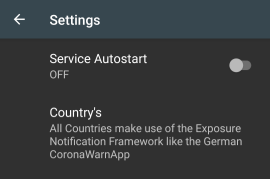

# Settings UUID 0xFD6F Tracer

## Prioritized Background Activity
OFF - Battery optimization has been disabled - To enabled it again you need to do this via the general device settings.
ON - You should only enabled this setting when you encounter unexpected app terminations by the OS.

## Service Autostart
OFF
ON - The 'Background Tracer Service' will be automatically started after a device reboot (after successful login)

## Display total number
OFF
ON - The app also shows the total of all beacons found so far (restart the service to reset).

## Countries

Countries might not be the best description here - since you can configure basically on which beacon UUIDs the App is
listening.

- UUID **0xDF6F**: Countries in which Apps are in place that make use of the ExposureNotification Framework developed by
Apple & Google. Please find a list below
- UUID **0xDF64**: StopCovid France
- UUID **0xDF6F** and **0xDF64**: So a combination of both UUIDs - where the app is going to display for each UUID a
separate counter (in the App - not in the system notification)

[List of countries that make use of the _Exposure Notification Framework_ (UUID 0xFD6F Beacaons)](./COUNTRIES.md)